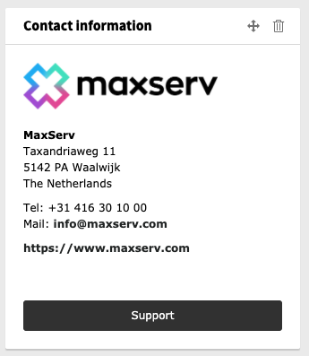

.. include:: ../Includes.txt

.. _contact-widget:

===========================
Contact Widget
===========================

This widget will show you the contact information of your your TYPO3 supplier.
To show your supplier contact information some configuration is required.

   An example of the contact widget with supplier information.

Options
-------
This widget has some options. To override the default options, see :ref:`Adjust settings of registered widgets <dashboard:adjust-settings-of-registered-widgets>`.

An example:

.. code-block:: yaml

   dashboard.buttons.contact:
     class: 'TYPO3\CMS\Dashboard\Widgets\Provider\ButtonProvider'
     arguments:
       $title: 'Support'
       $link: 'https://maxserv.com/support'
       $target: '_blank'

   widgets.dashboard.widget.contact:
     class: 'FriendsOfTYPO3\Widgets\Widgets\ContactWidget'
     arguments:
       $view: '@dashboard.views.widget'
       $buttonProvider: '@dashboard.buttons.contact'
       $options:
         template: 'Widget/ContactWidget'
         introText: ''
         company: 'MaxServ'
         address: 'Taxandriaweg 11'
         postalCode: '5142 PA'
         place: 'Waalwijk'
         country: 'The Netherlands'
         tel: '+31 416 30 10 00'
         mail: 'info@maxserv.com'
         website: 'https://www.maxserv.com'
         logoPath: 'https://typo3.com/fileadmin/partner/logo-maxserv-zonder-groot.png'
