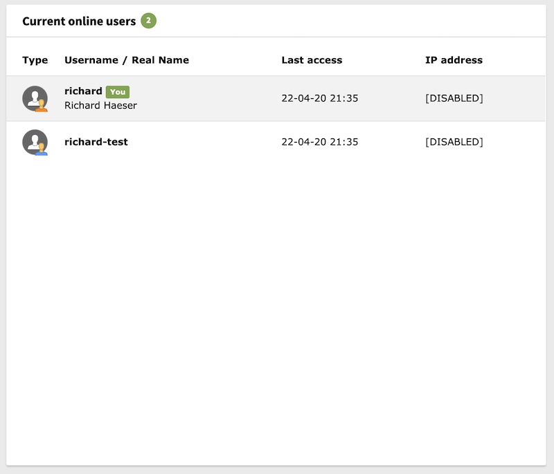

.. include:: ../Includes.txt

.. _online-users-widget:

===========================
Current Online Users Widget
===========================

This widget will show you who is currently logged in in the backend of your
TYPO3 installation. This can be quite useful when you want to do maintenance
and need to know if people are still using the installation.

   An overview of the current online users

Options
-------
There are no options available for this widget.
