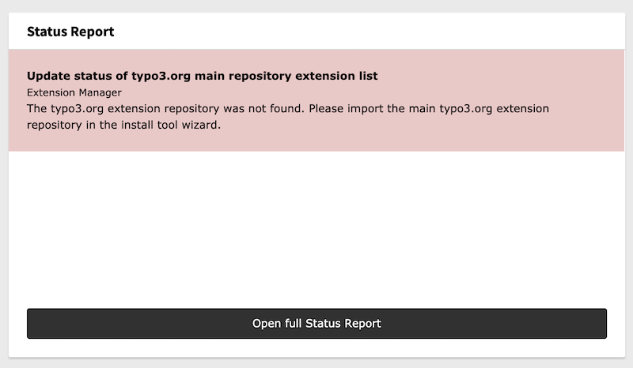

.. include:: ../Includes.txt

.. _status-report-widget:

====================
Status Report Widget
====================

This widget will give you an overview of all possible problems in your installation.
You can also click on the link to go to the reports module.

   This is how the Status Report widget could look like.

.. important::

   This widget is only available when you have **EXT:reports** installed and activated

Options
-------
This widget has some options. To override the default options, see :ref:`Adjust settings of registered widgets <dashboard:adjust-settings-of-registered-widgets>`.

.. option:: showErrors

   Define if you want to show reports with the severity error in your widget.

   **Default:** true

.. option:: showWarnings

   Define if you want to show reports with the severity warning in your widget.

   **Default:** false
